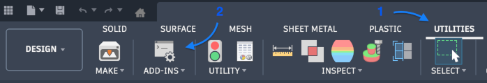
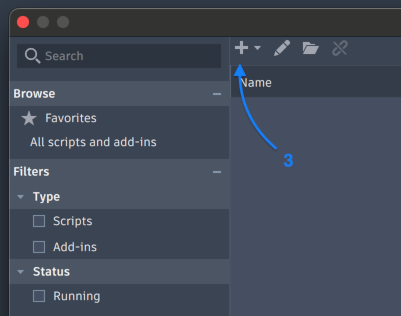
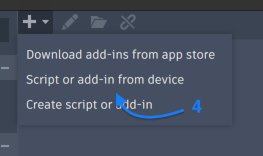
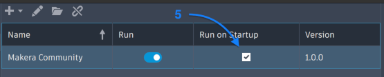

# Makera Community Fusion Plugin

The Autodesk Fusion plugin created by the Makera Community

## Overview
This repository contains the Autodesk Fusion add-in by the Makera Community. It allows you to do post post-processing of the g-code that the community post-processor generates.

## Features
- It takes each operation and outputs either one file per operation, per setup, per setup and tool or one single file. 
- Rotation of the A-axis if one is installed for support of indexed milling.
- Allows tool changes in a single setup
- Adds rapid moves when no cut is being made
- ... and more!

## Acknowledements
This plugin was heavily inspired by Tim Patersons [PostProcessAll](https://github.com/TimPaterson/Fusion360-Batch-Post) plugin. It started as an attempt to extend his work to allow processing of multiple Setups and adding A-axis rotations between them to allow indexed milling, but in the end it just wasn't as simple as I had in my mind so I decided to just build it from scratch and replicate the functionality instead.

## Requirements
- Autodesk Fusion (Personal Edition)
- [Makera post-processor](https://github.com/Carvera-Community/Carvera_Community_Profiles/tree/main/CAM_Post_Processors) (or a post-processor for your CNC-machine)

## Installation
This plugin follows the normal plugin-installation procedure of a local add-in for Fusion.
1. Clone the repository:

Using a git client you start by downloading this repository into a folder of your choice:

```bash
# SSH (recommended if you have SSH keys configured):
git clone git@github.com:Carvera-Community/CarveraCommunity_FusionPlugin.git "Makera Community"

# OR HTTPS:
git clone https://github.com/Carvera-Community/CarveraCommunity_FusionPlugin.git "Makera Community"

```
Follow the generic instructions to install add-ins into Fusion 360:



1. Go to Utilities
2. Open Scripts and add-ins...



3. Click the '+' above the table with plugins and scripts



4. Choose 'Script or add-in from device' and select the folder that you just cloned the repo to (the folder with the Makera Community.manifest file)



5. (Optional) Tick the checkbox to run the plug-in on startup
6. Done!

You should now se a new icon in the Manufacture workspace, next to the Setup sheet under Milling.

## Usage
(To be added)

## Development
- Create a development branch:

```bash
git checkout -b dev
```

- Commit and push changes:

```bash
git commit -m "Describe your changes"
git push -u origin dev
```

## Project Structure (key files)
- `Makera Community.py` – main add-in entry point
- `config.py` – global configuration
- `commands/` – base folder for all add-ons to Fusion
- `commands/postProcessor` - The post post-processor
- `commands/postProcessor/dialog` - UI parts
- `commands/postProcessor/dialog/resources/i18n` - Translations
- `lib/` – general helper libraries

## Contributing
- Fork the repository and open pull requests against `dev`.
- Follow the project's code style and write clear commit messages.

## License
GNU General Public License v2.0

## Contact
Use Github issues for any issues